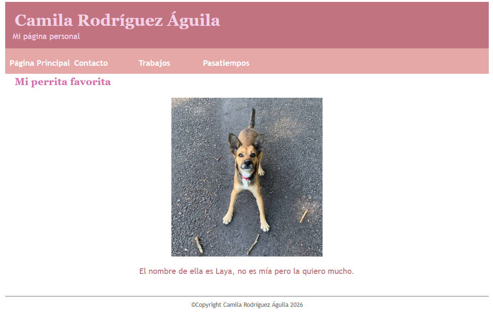
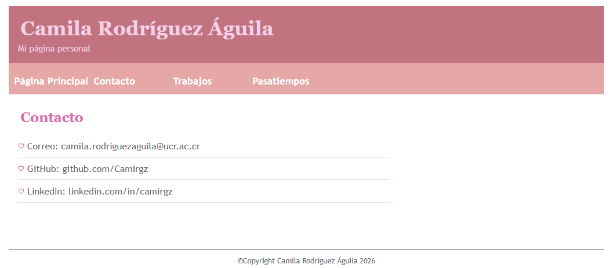
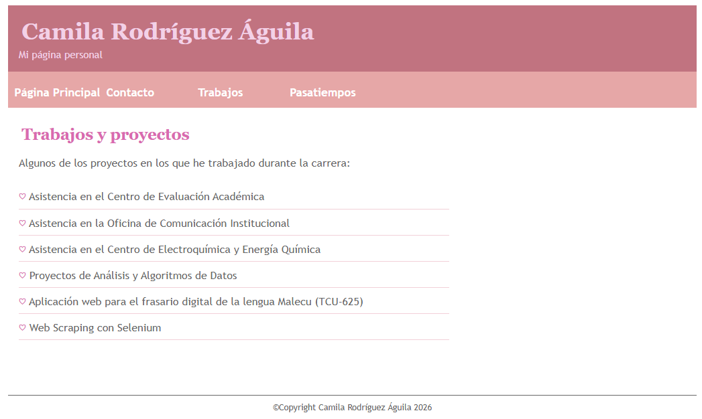
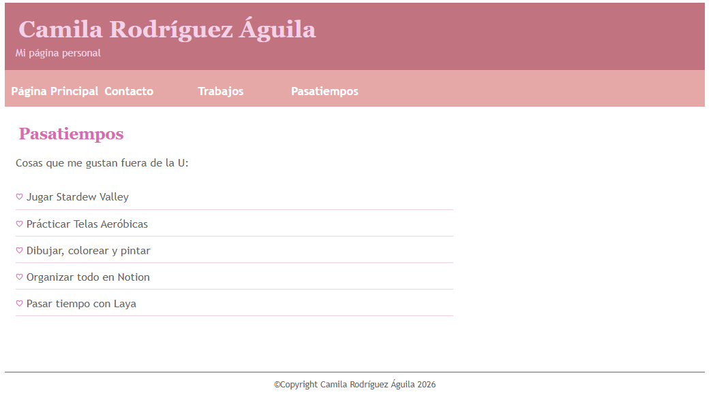

# Laboratorio 2A — Página Personal
**Camila Rodríguez Águila | C36624**

Sitio web personal desarrollado con HTML y CSS puro como parte del laboratorio 2A.

---

## Páginas

### Página Principal
Página de inicio con encabezado, barra de navegación, foto de Laya y pie de página.

---

### Contacto
Información de contacto: correo UCR, GitHub y LinkedIn.

---

### Trabajos
Lista de proyectos y trabajos realizados durante la carrera, incluyendo asistencias y proyectos universitarios.

---

###  Pasatiempos
Actividades que disfruto fuera de la universidad: Stardew Valley, telas aeróbicas, dibujar, Notion y más.

---

## Cómo abrir el proyecto

1. Descomprimir el archivo `.zip`
2. Abrir `index.html` en cualquier navegador
3. Navegar entre las páginas usando la barra de navegación

---

## Tecnologías

- HTML5
- CSS3
