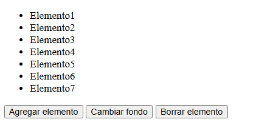
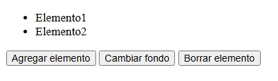
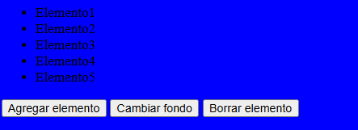

# Laboratorio 2B — Ejercicio JavaScript
**Camila Rodríguez Águila | C36624**

Ejercicio de JavaScript puro que manipula el DOM mediante tres funciones interactivas: agregar elementos a una lista, cambiar el color de fondo y borrar elementos.

## Funcionalidades

### Agregar elemento
Agrega un nuevo `<li>` al final de la lista con el texto `ElementoX`, donde X es el número siguiente según la cantidad de elementos actuales.

---

### Borrar elemento
Elimina el último `<li>` de la lista. Si la lista está vacía, no hace nada.

---

### Cambiar fondo
Cambia el fondo de toda la página a azul. Si se presiona de nuevo, lo regresa a blanco.

---

## Cómo ejecutar

1. Descomprimir el archivo `.zip`
2. Asegurarse de que `Pagina.html` y `script.js` estén en la **misma carpeta**
3. Abrir `Pagina.html` en cualquier navegador

---

## Tecnologías

- HTML (XHTML 1.0 Transitional)
- JavaScript puro (vanilla JS)

